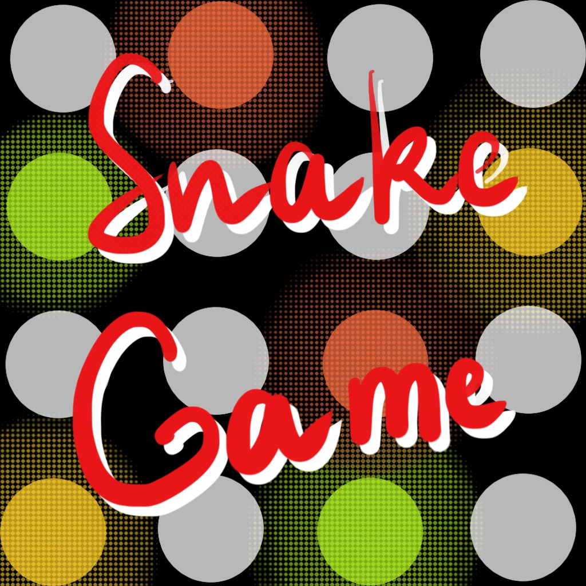

# **SnakeGame**
## Canonical snake game on pygame

The Snake Game is a game where player controls the snake, which becomes longer eating fruits around it.

**_Rules in the game_:**
1. You need to eat fruits and earn how much as you can.
2. Set records.
3. Have fun with colorful snake:)

**_How to install an App_(2 variants)?**
1. Install Python the latest version (3.10.6) here [GitHub Pages (https://www.python.org/downloads/).
2. Write in console pip install че-то там

**_How to run the game_?**
 хрен его пока знает 

**_Opportunities in game_:**
- You can meet 5 different types of fruits;
- You can enjoy the first marvelous and colorful snake in the game written on python;

#### GNU GENERAL PUBLIC LICENSE